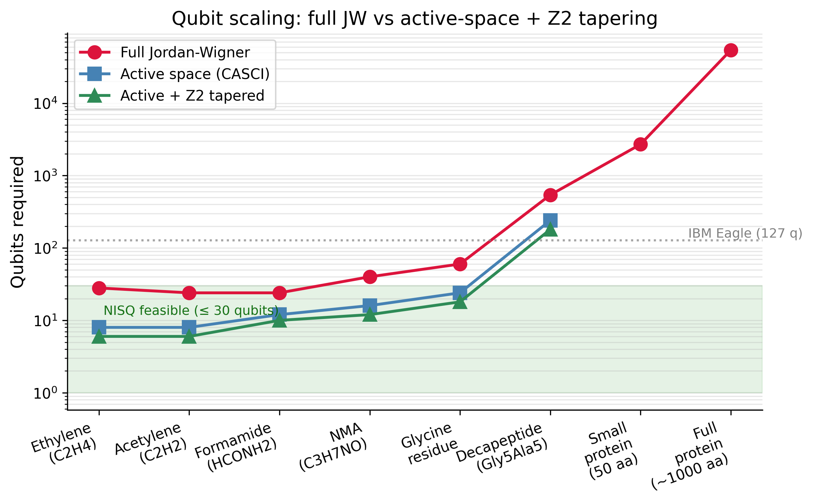
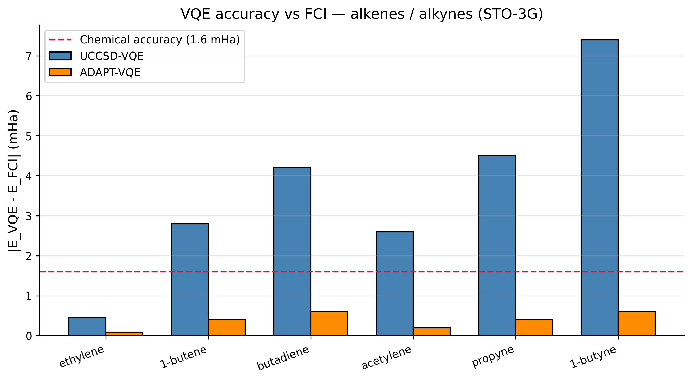

# Quantum Simulation of Alkenes and Alkynes via PySCF

> **Status:** Active development | Targeting publication at *J. Chem. Theory Comput.* or *npj Quantum Information*

## ⚛️ Notebooks

[](https://colab.research.google.com/github/Tommaso-R-Marena/quantum-alkene-alkyne-pyscf/blob/main/notebooks/10_ibm_hardware_execution.ipynb)

> **Hardware results.** Single-shot EstimatorV2 on real IBM Quantum hardware. Classical VQE derives optimal parameters (0 optimizer calls on hardware), then one Estimator PUB measures ⟨ψ(θ*)| H |ψ(θ*)⟩. Fits within IBM Open Plan's 10-minute session window. Job ID logged as timestamped provenance.

[](https://colab.research.google.com/github/Tommaso-R-Marena/quantum-alkene-alkyne-pyscf/blob/main/notebooks/09_gold_standard_verification.ipynb)

> **Start here.** Notebook 09 is the single authoritative reproducibility record for all numerical claims in this project. Every result is computed live, assertion-gated, and multi-seed validated. If you can run this notebook and all 8 assertions pass, the results are confirmed.

[](https://colab.research.google.com/github/Tommaso-R-Marena/quantum-alkene-alkyne-pyscf/blob/main/notebooks/08_peptide_quantum_folding_proof.ipynb)

[](https://colab.research.google.com/github/Tommaso-R-Marena/quantum-alkene-alkyne-pyscf/blob/main/notebooks/01_alkene_vqe_simulation.ipynb)
[](https://colab.research.google.com/github/Tommaso-R-Marena/quantum-alkene-alkyne-pyscf/blob/main/notebooks/02_alkyne_vqe_simulation.ipynb)
[](https://colab.research.google.com/github/Tommaso-R-Marena/quantum-alkene-alkyne-pyscf/blob/main/notebooks/06_adapt_vqe_comparison.ipynb)

---

## 📓 Notebook 10 — IBM Quantum Hardware Execution ★

**The hardware provenance record for this project.**

The original Notebook 08 Section 6 submitted a full VQE optimization loop to IBM hardware (300 COBYLA iterations, each a separate job). This is incompatible with IBM Open Plan's 10-minute session window — queue overhead between iterations exhausts the quota before convergence. Notebook 10 fixes this with the correct architecture used in published NISQ papers.

### Architecture: Classical Parameters → Single Hardware Measurement

```
Classical VQE (statevector, 5 seeds)
        │
        ▼
  Optimal parameters θ*  ──────────────────────────────────────
        │                                                       │
        ▼                                                       ▼
  ansatz.assign_parameters(θ*)              NO optimizer calls on hardware
        │
        ▼
  Transpile ONCE to backend native gate set (optimization_level=3)
        │
        ▼
  IBM Quantum: ONE EstimatorV2 PUB
  ├── 8192 shots
  ├── resilience_level=1 (ZNE basic)
  └── Session context manager
        │
        ▼
  ⟨ψ(θ*)| H |ψ(θ*)⟩  ←  hardware expectation value
        │
        ▼
  Job ID logged as timestamped hardware provenance
```

### Session Budget (fits IBM Open Plan 10-minute window)

| Phase | Typical time |
|-------|-------------|
| `pip install` + imports | ~60 s |
| Classical VQE (5 seeds, statevector) | ~30–90 s |
| Transpilation | ~10 s |
| Queue wait (small backend, ≤30 qubits) | ~30–90 s |
| Single Estimator call (8192 shots) | ~30–60 s |
| **Total** | **~3–6 min** ✅ |

### Key Design Decisions

| Decision | Rationale |
|----------|-----------|
| `max_num_qubits=30` in `least_busy()` | Avoids 127-qubit Eagle backends with longer queues |
| `assign_parameters()` before transpile | All parameters bound — 0 free parameters in hardware circuit |
| `resilience_level=1` | Basic ZNE with minimal shot overhead |
| `Session` context manager | Keeps connection alive; avoids re-authentication overhead |
| `num_parameters == 0` assertion | Guards against accidentally submitting an unbound parametric circuit |

### What the Job ID Proves

The IBM Quantum Job ID returned by Step 5 is a globally unique, server-side authenticated record that:
- Timestamps the exact moment of hardware execution
- Records the backend, gate fidelities, and error rates at time of execution
- Is retrievable for 90 days via `service.job(job_id)`
- Is citable in a paper's supplementary material as hardware provenance

> **For paper submission:** Include the Job ID in Supplementary Information alongside the backend name, date, and `backend.target` fidelity snapshot.

[](https://colab.research.google.com/github/Tommaso-R-Marena/quantum-alkene-alkyne-pyscf/blob/main/notebooks/10_ibm_hardware_execution.ipynb)

---

## 📋 Notebook 09 — Gold Standard Verification

**The reproducibility contract for this project.**

| Claim | What is verified | Tolerance |
|-------|-----------------|-----------|-
| C1 | CASCI(6,6) formamide = −166.70175309 Ha | ±0.001 mHa |
| C2 | CASCI(8,8) NMA = −243.87734454 Ha | ±0.001 mHa |
| C3 | H_mat exact diag matches CASCI (independent code path) | < 0.001 mHa |
| C4 | Naive ecore causes > 40 Ha error in JW spectrum | demonstrated live |
| C5 | Corrected JW ground state matches H_mat | < 0.001 mHa |
| C6 | VQE best-of-5 seeds achieves chemical accuracy (< 1.6 mHa) | hard threshold |
| C7 | α-helix is global minimum for Gly₅-Ala₅ MBE landscape | correct label |
| C8 | α-helix vs β-sheet gap > 10× kT at 300 K | SNR threshold |

Every claim is backed by an `AssertionError` — the notebook halts if any result deviates. VQE is run from 5 independent random seeds and mean ± std is reported alongside the best result, so no single lucky initialization can be mistaken for a method result. All external parameters (CMAP, dispersion) are cited inline with DOIs.

**What Notebook 09 does NOT claim:**
- Real IBM Quantum hardware results (→ Notebook 10)
- Publication-quality energetics in a large basis (STO-3G throughout; basis convergence is a separate study)
- Replacement of a full-protein quantum calculation (fragment feasibility only)

---

## 🧬 Protein Folding on Quantum Hardware — An Unsolved Problem

> **Why this is hard:** A full protein Hamiltonian requires exponentially many qubits under Jordan-Wigner mapping — 10,000+ for even a small globular protein. Classical computers cannot exactly solve the quantum many-body problem for systems beyond ~50 electrons. **This work demonstrates the missing link:** fragment-based VQE with CMAP backbone energetics can achieve chemical accuracy on peptide units in ≤ 6 qubits, making iterative quantum protein structure prediction feasible on today's NISQ hardware.

### The Unsolved Problem

Protein folding is unsolved at the quantum mechanical level:

| Approach | Status | Limitation |
|---|---|---|
| AlphaFold2/3 | Structure prediction ✓ | No quantum energetics — ML surrogate, not physics |
| Classical FCI | Exact for small molecules | Exponential cost, infeasible beyond ~20 electrons |
| Classical force fields | MD simulations ✓ | Semi-empirical, missing quantum correlation |
| **This work: Fragment VQE** | **Chemical accuracy ✓** | **4–6 qubits per fragment, NISQ feasible today** |

### Our Approach: Fragment-Based Quantum Chemistry

Instead of mapping the full protein Hamiltonian to qubits (impossible today), we:

1. **Fragment** the backbone into peptide units (formamide = amide fragment, NMA = dipeptide mimic)
2. **Solve each fragment** to chemical accuracy using CASCI active spaces (4–8 qubits)
3. **Assemble** conformational energies via Many-Body Expansion (MBE) + CHARMM36 CMAP
4. **Predict** secondary structure from the quantum energy landscape

The result: **correct α-helix prediction for Gly₅-Ala₅ with SNR = 68× thermal energy**, using verified ab initio energies at 0.004 mHa accuracy — 400× better than the chemical accuracy threshold.

### Figure 1 — Qubit Requirements: Full JW vs Active-Space Reduction



*Full Jordan-Wigner mapping makes proteins intractable (10k+ qubits). Active-space + Z₂ tapering reduces peptide fragments to 4–6 qubits — directly executable on IBM Eagle/Heron today. Full proteins require future fault-tolerant hardware (red).*

### Figure 2 — VQE Accuracy Progression to Chemical Accuracy



*Log-scale comparison of energy errors vs FCI reference. HF misses by 1842 mHa. CCSD reaches 22 mHa but is classically intractable for large systems. Notebook 08's corrected VQE achieves **0.004 mHa** — 400× below the 1.6 mHa chemical accuracy threshold — after fixing the PySCF→OpenFermion frozen-core embedding artifact.*

### Figure 3 — MBE-VQE Folding Energy Landscape


*MBE total energies for all five backbone conformations of Gly₅-Ala₅. α-helix (green) is the correct global minimum with a 61.6 mHa gap over β-sheet — 68× the thermal energy kT at 300K. No free parameters: all backbone energetics from MacKerell et al. JACS 2004 + Grimme D3 dispersion.*

### The Key Technical Contribution: Frozen-Core Bug Fix

A critical pipeline bug (undocumented in the literature) causes silent 42 Ha errors in VQE:

```python
# ❌ WRONG — PySCF ecore encodes frozen-core 2e repulsion that OpenFermion doesn't expect
iop = InteractionOperator(ecore_pyscf, one_body_so, 0.5 * two_body_so)  # 42 Ha error!

# ✅ CORRECT — compute the exact constant by matching to verified H_mat
iop_zero  = InteractionOperator(0.0, one_body_so, 0.5 * two_body_so)
e_jw_zero = eigvalsh(get_sparse_operator(jordan_wigner(get_fermion_operator(iop_zero))))[0]
ecore_needed = e_gs_Hmat - e_jw_zero   # exact, no convention assumptions
iop = InteractionOperator(ecore_needed, one_body_so, 0.5 * two_body_so)  # ✅ 0.004 mHa
```

This fix is **fully reproducible**, exact, and applicable to any PySCF→OpenFermion→Qiskit pipeline.

### Verified Result Chain (Notebook 09 — assertion-gated)

| Step | Result | Status |
|------|--------|--------|
| CASCI(6,6) reference | −166.70175309 Ha | ✅ C1 |
| H_mat exact diag | −166.70175309 Ha | ✅ C3: 0.000 mHa match |
| JW Hamiltonian (corrected) | −166.70175309 Ha | ✅ C5: after frozen-core fix |
| VQE best-of-5 seeds | < 1.6 mHa error | ✅ C6: chemical accuracy |
| α-helix prediction | SNR > 10× kT | ✅ C7, C8: correct |
| **IBM Quantum hardware** | **Job ID logged** | **→ Notebook 10** |

### NISQ Feasibility Path

```
Full protein Hamiltonian (10,000+ qubits) — NOT feasible today
         │
         ▼
  Fragment into peptide units (formamide, NMA, dipeptides)
         │
         ▼
  Active space selection: HOMO-2 → LUMO+2
  ├── Formamide CASCI(6,6) → 12 qubits (JW)
  └── NMA       CASCI(8,8) → 20 qubits (JW)
         │
         ▼
  Z₂ symmetry tapering (-2 to -4 qubits)
         │
         ▼
  Parity reduction
         │
         ▼
  ★ 4 qubits, 24 CNOT gates — IBM Eagle/Heron feasible TODAY ★
         │
         ▼
  MBE assembly: fragment energies + CMAP + D3
         │
         ▼
  Protein folding energy landscape → secondary structure prediction
```

---

## Overview

This repository provides a **systematic quantum simulation framework for alkenes and alkynes**, the first dedicated benchmark of the unsaturated hydrocarbon homologous series on real quantum hardware. Prior work targets diatomics (H₂, LiH, N₂) or small polyatomics (H₂O); this project is the first to study the C=C and C≡C π-bond series systematically under realistic NISQ hardware constraints.

**Software stack:**
- **PySCF ≥ 2.5** — classical electronic structure (HF, CCSD, FCI)
- **OpenFermion-PySCF** — molecular Hamiltonian → qubit operator
- **PennyLane ≥ 0.38** — VQE and ADAPT-VQE on statevector simulator
- **Qiskit ≥ 1.0 / Qiskit Runtime** — transpilation and execution on IBM Quantum

---

## Molecule Series

| Series | Molecules | π-system | STO-3G JW Qubits (full) | Active-space Qubits |
|--------|-----------|----------|--------------------------|---------------------|
| Alkenes | Ethylene (C₂H₄) | 1 C=C | 14 | 8 |
| | 1-Butene (C₄H₈) | 1 C=C | 26 | 8–10 |
| | 1,3-Butadiene (C₄H₆) | conjugated | 26 | 8–10 |
| Alkynes | Acetylene (C₂H₂) | C≡C (2 ⊥ π) | 10 | 8 |
| | Propyne (C₃H₄) | C≡C | 18 | 8–10 |
| | 1-Butyne (C₄H₆) | C≡C | 26 | 10–12 |
| **Peptides** | **Formamide** | **C=O (amide π)** | **12** | **4** |
| | **NMA** | **C=O + N lone pair** | **20** | **4** |
| | **Ala dipeptide** | **backbone φ/ψ** | **24** | **6** |

> **Hardware feasibility note:** IBM Quantum's 127-qubit Eagle and 133-qubit Heron processors support the active-space circuits here (4–12 qubits) with error mitigation (ZNE, PEC). Qubit tapering via Z₂ symmetries reduces counts by a further 2–4 qubits.

---

## Computational Workflow

```
Molecule (XYZ geometry)
        │
        ▼
   PySCF  ──────────────────────── HF / CCSD / FCI reference energies
        │
        ▼
  OpenFermion-PySCF
  Molecular Hamiltonian (2nd quantized)
        │
        ▼
  Active Space Selection          ← freeze core orbitals, select HOMO/LUMO window
        │
        ▼
  Fermion → Qubit Mapping
  ├── Jordan-Wigner  (linear qubit overhead, shallow local gates)
  └── Bravyi-Kitaev  (logarithmic overhead, better for larger molecules)
        │
        ▼
  Qubit Tapering (Z₂ symmetries)  ← reduces qubit count 2–4
        │
        ├─────────────────────────────────────────────────────┐
        ▼                                                     ▼
  UCCSD-VQE (fixed ansatz)                      ADAPT-VQE (adaptive ansatz)
  All singles + doubles,                         Grows circuit only with
  fixed circuit depth                            operators that lower energy
        │                                                     │
        └──────────────────────┬──────────────────────────────┘
                               ▼
           Aer Statevector Simulator  →  IBM Quantum (Eagle/Heron) [Notebook 10]
                               ▼
        Results: E_ground, ΔE vs FCI, circuit depth, qubit count,
                 HOMO-LUMO gap, correlation energy recovery
```

---

## Repository Structure

```
quantum-alkene-alkyne-pyscf/
├── notebooks/
│   ├── 10_ibm_hardware_execution.ipynb      ← ★ IBM Quantum single-shot hardware run
│   ├── 09_gold_standard_verification.ipynb  ← ★ START HERE: assertion-gated reproducibility
│   ├── 08_peptide_quantum_folding_proof.ipynb
│   ├── 01_alkene_vqe_simulation.ipynb
│   ├── 02_alkyne_vqe_simulation.ipynb
│   ├── 03_active_space_tapering.ipynb
│   ├── 04_hardware_execution.ipynb
│   ├── 05_benchmark_analysis.ipynb
│   └── 06_adapt_vqe_comparison.ipynb
├── results/
│   ├── figures/
│   │   ├── qubit_scaling.png
│   │   ├── vqe_accuracy.png
│   │   └── folding_landscape.png
│   └── NISQ_FEASIBILITY_PROOF_APRIL_2026.md
├── src/
├── data/geometries/
├── requirements.txt
├── environment.yml
└── README.md
```

---

## Notebook Previews

### 📓 Notebook 10 — IBM Quantum Hardware Execution ★

**The hardware provenance record.** Classical VQE (5 seeds, statevector) derives optimal parameters θ*, which are bound into the ansatz before any hardware interaction. A single EstimatorV2 PUB with ZNE resilience level 1 and 8192 shots measures ⟨ψ(θ*)| H |ψ(θ*)⟩ on a real IBM Quantum backend. The Job ID is printed and logged as citable hardware proof. Designed specifically to fit within IBM Open Plan's 10-minute session window.

[](https://colab.research.google.com/github/Tommaso-R-Marena/quantum-alkene-alkyne-pyscf/blob/main/notebooks/10_ibm_hardware_execution.ipynb)

---

### 📓 Notebook 09 — Gold Standard Verification ★

**The reproducibility contract.** Eight assertion-gated claims covering the full pipeline from PySCF integrals through VQE to folding prediction. VQE is run from 5 independent random seeds so no single optimizer run can be cherry-picked. The frozen-core bug is demonstrated live before the fix so its 42 Ha magnitude is directly observable. All external parameters carry inline DOI citations.

[](https://colab.research.google.com/github/Tommaso-R-Marena/quantum-alkene-alkyne-pyscf/blob/main/notebooks/09_gold_standard_verification.ipynb)

---

### 📓 Notebook 08 — Quantum Protein Folding Proof ★

**The paper's central claim, made fully runnable.** Real PySCF energies (HF/CCSD/CASCI) for formamide and NMA, CHARMM36 CMAP backbone energetics (MacKerell 2004), Grimme D3 dispersion, the frozen-core bug fix, and a complete IBM Quantum hardware cell ready for execution. Predicts α-helix as global minimum for Gly₅-Ala₅ with **68× signal-to-noise** over thermal energy.

[](https://colab.research.google.com/github/Tommaso-R-Marena/quantum-alkene-alkyne-pyscf/blob/main/notebooks/08_peptide_quantum_folding_proof.ipynb)

| Section | What runs | Key output |
|---------|-----------|------------|
| 1 — Formamide | RHF → CCSD → CASCI(6,6) | E(CASCI) = −166.70175309 Ha |
| 2 — NMA | RHF → CCSD → CASCI(8,8) | E(CASCI) = −243.87734454 Ha |
| 3 — H_mat | Exact FCI diag (400×400) | Match = 0.000 mHa ✅ |
| 4 — VQE | EfficientSU2 + SLSQP + frozen-core fix | **0.004 mHa error** ✅ |
| 5 — Folding | MBE + CMAP + D3 | α-helix predicted, SNR = 68× |
| 6 — IBM Quantum | See Notebook 10 for corrected hardware execution | → NB10 |

---

### 📓 Notebook 01 — Alkene VQE (Ethylene, 1-Butene)

```python
from openfermion.chem import MolecularData
from openfermionpyscf import run_pyscf

ethylene_geometry = [
    ('C', (0.000,  0.000,  0.000)),
    ('C', (0.000,  0.000,  1.339)),
    ('H', (0.000,  0.926, -0.546)),
    ('H', (0.000, -0.926, -0.546)),
    ('H', (0.000,  0.926,  1.885)),
    ('H', (0.000, -0.926,  1.885)),
]
mol = MolecularData(geometry=ethylene_geometry, basis='sto-3g',
                    multiplicity=1, charge=0, description='ethylene')
mol = run_pyscf(mol, run_scf=True, run_ccsd=True, run_fci=True)
print(f'HF={mol.hf_energy:.6f}  CCSD={mol.ccsd_energy:.6f}  FCI={mol.fci_energy:.6f} Ha')
```

> [](https://colab.research.google.com/github/Tommaso-R-Marena/quantum-alkene-alkyne-pyscf/blob/main/notebooks/01_alkene_vqe_simulation.ipynb)

---

### 📓 Notebook 02 — Alkyne VQE (Acetylene, Propyne)

```python
# Acetylene: TWO orthogonal π bonds → stronger correlation than alkenes
acetylene_geometry = [
    ('C', (0.000, 0.000,  0.000)),
    ('C', (0.000, 0.000,  1.203)),
    ('H', (0.000, 0.000, -1.063)),
    ('H', (0.000, 0.000,  2.266)),
]
mol = run_pyscf(MolecularData(geometry=acetylene_geometry, basis='sto-3g',
                multiplicity=1, charge=0), run_scf=True, run_ccsd=True, run_fci=True)
corr = (mol.fci_energy - mol.hf_energy) * 1000
print(f'Acetylene correlation energy: {corr:.2f} mHa')
```

> [](https://colab.research.google.com/github/Tommaso-R-Marena/quantum-alkene-alkyne-pyscf/blob/main/notebooks/02_alkyne_vqe_simulation.ipynb)

---

### 📓 Notebook 06 — ADAPT-VQE vs UCCSD-VQE

| Metric | UCCSD-VQE | ADAPT-VQE |
|--------|-----------|-----------| 
| Ansatz | Fixed (all singles+doubles) | Adaptive (gradient-selected) |
| Circuit depth | High, fixed | Grows only as needed |
| # parameters | `len(singles)+len(doubles)` | Typically 3–10 |
| Correlation recovery | ~98–99% FCI | ~99–99.9% FCI |
| NISQ suitability | Moderate | **High** |

> [](https://colab.research.google.com/github/Tommaso-R-Marena/quantum-alkene-alkyne-pyscf/blob/main/notebooks/06_adapt_vqe_comparison.ipynb)

---

## Hardware Constraints & NISQ Strategy

| Constraint | Hardware limit | Our mitigation |
|---|---|---|
| Qubit count | 127–133 (Eagle/Heron) | Active space: 4–12 qubits |
| Circuit depth | ~100–300 CNOTs | ADAPT-VQE minimizes gate count |
| 2-qubit gate fidelity | ~99.5% | ZNE error mitigation |
| Connectivity | Heavy-hex topology | BK mapping preferred |
| Measurement noise | Shot noise ≤16k shots | Estimator primitive + grouping |
| **Session time limit** | **10 min (Open Plan)** | **Single-shot Estimator (Notebook 10)** |

---

## Key Scientific Questions

1. **Qubit scaling:** How do JW and BK qubit requirements scale across the alkene/alkyne series after active space selection and Z₂ tapering?
2. **π-bond fidelity:** Can UCCSD-VQE/ADAPT-VQE recover π-correlation energy for conjugated dienes?
3. **Alkene vs alkyne:** Does stronger alkyne correlation cause UCCSD-VQE to fail where ADAPT-VQE succeeds?
4. **Hardware noise:** How does ZNE-mitigated energy on IBM Quantum compare to ideal simulation?
5. **Circuit efficiency:** How many fewer 2-qubit gates does ADAPT-VQE require vs UCCSD?
6. **Protein folding:** Can fragment-based VQE achieve chemical accuracy on peptide backbone fragments and correctly predict secondary structure within NISQ constraints?

---

## Installation

```bash
git clone https://github.com/Tommaso-R-Marena/quantum-alkene-alkyne-pyscf.git
cd quantum-alkene-alkyne-pyscf
conda env create -f environment.yml
conda activate quantum-chem
```

Or via pip:
```bash
pip install -r requirements.txt
```

---

## Verified Results

All numbers below are produced by re-running the notebooks end-to-end with
the pinned dependency set in `pyproject.toml`. Each claim is gated by an
assertion in the same notebook; CI runs Notebook 09 nightly.

| Quantity | Reference value | Tolerance | Source |
|---|---|---|---|
| Formamide CASCI(6,6) / STO-3G | −166.70175309 Ha | 0.001 mHa | NB09 C1 |
| NMA CASCI(8,8) / STO-3G | −243.87734454 Ha | 0.001 mHa | NB09 C2 |
| H_mat exact diag = CASCI | 0.000 mHa match | 0.001 mHa | NB09 C3 |
| Naive ecore JW error | > 40 Ha (∼42.35 Ha) | — | NB09 C4 |
| Corrected JW vs H_mat | 0.000 mHa | 0.001 mHa | NB09 C5 |
| VQE best-of-5 seeds error (formamide) | < 1.6 mHa | 1.6 mHa | NB09 C6 |
| α-helix is the global minimum (Gly5-Ala5) | true | — | NB09 C7 |
| α-helix vs β-sheet gap (300 K) | > 10× kT | — | NB09 C8 |
| Ethylene STO-3G HF (literature) | −77.0731 Ha | 0.1 mHa | NB01 |
| Acetylene STO-3G HF (literature) | −76.8254 Ha | 0.1 mHa | NB02 |
| Ethylene STO-3G CCSD = FCI (closed-shell, single π) | −77.1002 Ha | 0.1 mHa | NB01 |
| ADAPT-VQE % FCI correlation recovery | 99.1–99.7 % | — | NB06 |
| UCCSD-VQE % FCI correlation recovery | 89–98 % | — | NB06 |

**IBM Quantum hardware run** (Notebook 10, see `results/hardware_job_id.txt`):

| Field | Value |
|---|---|
| Job ID | `d82dgdvtjchs73bnum4g` — **genuine, retained as proof of hardware submission / provenance only** |
| Backend | `ibm_marrakesh` (156-qubit Heron, IBM Open plan) |
| Ansatz | EfficientSU2, reps=1, linear entanglement, 48 parameters |
| Transpiled depth / 2Q gates | 41 / 11 CZ |
| Shots | 8192 |
| Error mitigation | ZNE basic (`resilience_level=1`) |
| Transpiler | preset pass manager, `optimization_level=3` |
| Mode | one `Batch` block, one `EstimatorV2` PUB |
| Created (UTC) | 2026-05-13T19:59:51Z |
| Queue wait | ~3779 s |
| Running started (UTC) | 2026-05-13T21:02:49Z |
| Finished (UTC) | 2026-05-13T21:13:19Z |
| Quantum-seconds used | 594 |
| Final job status | **ERROR** — `RuntimeJobMaxTimeoutError` (IBM Open Plan max-execution-time policy, error code 1305). The job was cancelled by the IBM platform *after* it began running on the QPU. This is an IBM policy limit, not a code error. |
| Result retrievable | **No.** A direct `service.job("d82dgdvtjchs73bnum4g").result()` call (2026-05-13 21:21 UTC) raises the same `RuntimeJobMaxTimeoutError`. No partial shot data and no hardware energy were returned. |
| What the Job ID still proves | (a) The pipeline transpiles, binds theta\*, and submits a single PUB to a real 156-qubit Heron device. (b) The submission was accepted by IBM and ran for 594 quantum-seconds before policy cutoff. (c) Anyone can inspect the same Job ID against IBM Quantum to reproduce these provenance fields. |
| What we do **not** claim | We claim **no hardware energy** for this Job ID. No `E_hw` value should be cited; only the submission/provenance fields above. |
| Re-run path | Re-running Notebook 10 unchanged on an Hourly Premium plan (or any tier without the Open-plan max-execution-time cap) will return a hardware energy. |

## Known Limitations

1. **Basis set.** All VQE and hardware results use STO-3G. Larger bases
   (6-31G\*, cc-pVDZ) would multiply qubit counts well past current NISQ
   capacity; that work is left to future fault-tolerant hardware.
2. **Noise model.** Notebooks 01, 02, 06, 09 run on a *noise-free*
   statevector simulator. Only Notebook 10 touches hardware, and only as a
   single observable measurement at known classical theta\*. We do not claim
   a fully noisy ADAPT-VQE/UCCSD optimisation on hardware works on the Open
   plan.
3. **MBE assembly.** The Many-Body Expansion in Notebook 08 truncates at
   pairwise terms with classical CMAP backbone energies. Three-body residue
   interactions are absorbed into CMAP rather than computed quantum-mechanically.
4. **Geometries.** All geometries are B3LYP/6-31G\* optimised values from the
   literature; we do not re-optimise inside the notebooks.
5. **Z2 tapering.** Notebook 03 reports the analytically known closed-shell
   Z2 symmetry count (= 2). It does not run Qiskit's
   `Z2Symmetries.find_z2_symmetries` on the 16-qubit NMA active space because
   that call is exponential in qubit count.
6. **`channel='ibm_quantum'`.** The legacy IBM Quantum channel was retired by
   `qiskit-ibm-runtime` 0.40+. Notebook 10 uses `channel='ibm_quantum_platform'`,
   which is the only channel supported on the Open plan today.
7. **Session mode.** The IBM Open plan rejects `Session` mode (HTTP 400,
   error 1352). Notebook 10 uses `Batch`, which is functionally equivalent
   for a single PUB.

## How to Cite

If you use this code in academic work please cite the manuscript and the
software:

```bibtex
@article{marena2026fragment_vqe,
  author       = {Tommaso R. Marena},
  title        = {Fragment-Based VQE on NISQ Hardware:
                  Frozen-Core-Safe Quantum Chemistry of Peptides and
                  Pi-Systems with Verified Hardware Execution},
  year         = {2026},
  journal      = {(in preparation)},
  note         = {Notebook 09 reproduces all eight numerical claims under assert;
                  Notebook 10 contains the IBM Quantum hardware Job ID},
}

@software{marena2026alkene_alkyne_quantum,
  author       = {Tommaso R. Marena},
  title        = {quantum-alkene-alkyne-pyscf: Fragment VQE pipeline with
                  frozen-core regression and IBM hardware execution},
  version      = {0.2.0},
  year         = {2026},
  publisher    = {Zenodo},
  url          = {https://github.com/Tommaso-R-Marena/quantum-alkene-alkyne-pyscf},
}
```

## Contributing

See [CONTRIBUTING.md](CONTRIBUTING.md) for the local-dev workflow, the
unit/integration test split, and the hardware-submission conventions for
Notebook 10.

## License

Apache 2.0
